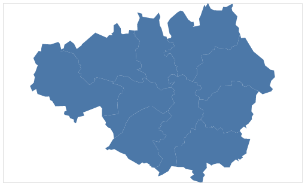

## Let’s Make a Map in Vega-Lite*

This is a short introduction to creating choropleth maps in [Vega-Lite](https://vega.github.io/vega-lite/). We’ll show you how to load geospatial data, customise maps and join attributes.

#### What is Vega-Lite?
[Vega-Lite](https://vega.github.io/vega-lite/) is an open source tool that allows you to turn raw data into a [range of interactive visualisations](https://vega.github.io/vega-lite/examples/). You read, transform and encode your data to visual properties in a single [JSON](https://www.json.org/) file that can be embedded in a web page.

#### Setup
The easiest way to start creating maps in Vega-Lite is to use their [online editor](https://vega.github.io/editor/#/custom/vega-lite). In the left-hand pane you can write the specifications required to create your map and preview the results before exporting it in PNG or [SVG](https://www.w3schools.com/graphics/svg_intro.asp) format.

The alternative method is to create a JSON file in a text editor such as [Atom](https://atom.io/) and use [Vega-Embed](https://github.com/vega/vega-embed) to embed your visualisation in a webpage.

#### Get the geospatial data
The UK's [Office for National Statistics](https://www.ons.gov.uk/) (ONS) provide free spatial data under the [Open Government Licence v3.0](https://www.nationalarchives.gov.uk/doc/open-government-licence/version/3/) on their [Open Geography portal](http://geoportal.statistics.gov.uk/). You can find digital vector boundaries for administrative and statistical geographies like wards, constituencies, and Lower Layer Super Output Areas (LSOAs).

Many of the vector boundaries are available in the World Geodetic System (WGS84) coordinate reference system. WGS84 uses degrees as its unit of measurement and coordinates are given in latitude and longitude. WGS84 is good at preserving the shape of countries so is ubiquitous in online mapping.

Each digital vector boundary layer is available in different resolutions: full resolution, generalised (20m), super generalised (200m) and ultra generalised (500m). High resolution layers are best used for spatial operations like point in polygon and lower resolution layers for interactive maps which need to load quickly.

Lastly, the coordinates of the centroid or geometric centre of the vector boundaries are provided. These coordinates can be useful for labelling areas.

We'll use [2017 local authority boundaries](http://geoportal.statistics.gov.uk/datasets/local-authority-districts-december-2017-super-generalised-clipped-boundaries-in-united-kingdom-wgs84) for the United Kingdom projected in WGS84 in a super generalised resolution suitable for web mapping.

#### Write the specifications
Each Vega-Lite visualisation is built from precise specifications:

- [Data](https://vega.github.io/vega-lite/docs/data.html) are read inline or via a URL in .json or .csv format.
- These data can then be optionally modified by filtering, aggregating, or by some other common [transformation](https://vega.github.io/vega-lite/docs/transform.html).
- A [mark](https://vega.github.io/vega-lite/docs/mark.html) like a bar, point, or line is then chosen to visually encode the data to.
- These [encodings](https://vega.github.io/vega-lite/docs/encoding.html) then determine how to map the data to the properties of these visual marks e.g. position (x, y), size, and colour.

These specifications show you explicitly how the variables in your data are mapped to marks like x, y, color, and stroke to produce graphics like this:



Take a look at the JSON behind it:

```
{
  "$schema": "https://vega.github.io/schema/vega-lite/v3.json",
  "width": 500,
  "height": 300,
  "data": {
    "url": "https://opendata.arcgis.com/datasets/686603e943f948acaa13fb5d2b0f1275_3.geojson",
    "format": {"property": "features"}
  },
  "transform": [
    {
      "filter": {
        "field": "properties.lad16nm",
        "oneOf": [
          "Bolton",
          "Bury",
          "Manchester",
          "Oldham",
          "Rochdale",
          "Salford",
          "Stockport",
          "Tameside",
          "Trafford",
          "Wigan"
        ]
      }
    }
  ],
  "projection": {"type": "mercator"},
  "mark": "geoshape"
}
```

The Vega-Lite specifications can be read as:

1) Set the [schema](https://vega.github.io/vega-lite/docs/spec.html#top-level) to enable validation and autocompletion in text editors. This line will appear in every Vega-Lite specification.   
2) Specify the [width and height](https://vega.github.io/vega-lite/docs/size.html) of your graphic.    
3) Read in your [data](https://vega.github.io/vega-lite/docs/data.html). We are passing the URL of the digital vector boundary GeoJSON file from the [Open Geography portal](http://geoportal.statistics.gov.uk/). You can find the URL link to the GeoJSON file on all boundary file pages under 'APIs'. You'll note that we have also supplied `"format": {"property": "features"}` to pull out the attributes nested in the properties object of the GeoJSON file.  
4) Transform the data by [filtering](https://vega.github.io/vega-lite/docs/filter.html) out local authorities that aren't in Greater Manchester. He we use the 'oneOf' predicate and supply a string of local authority names that can be matched in the 'lad16nm' variable. Note that we have appended 'properties' to the variable name because it is nested within the `properties` object of the GeoJSON file.  
5) Confirm the [projection](https://vega.github.io/vega-lite/docs/projection.html). The default projection in Vega-Lite is WGS84 so it is not strictly necessary to specify this.  
6) Specify [geoshape](https://vega.github.io/vega-lite/docs/geoshape.html) as the mark to plot the geometry of the GeoJSON object e.g. points, lines or polygons.

The default stroke and fill styles for geometry types is not ideal so let's customise our map.

### Customising your map
We can change the stroke and fill of the polygons by adjusting the properties of the 'geosphape' mark:

```
"mark": {
    "type": "geoshape",
    "fill": "#eee",
    "stroke": "#757575",
    "strokeWidth": 0.5
  }
```


We can also add labels to help identify the individual local authorities. The trick here is to add a new layer: a [text](https://vega.github.io/vega-lite/docs/text.html) mark. To do this we need to nest both the 'geoshape' and 'text' properties within a [layer](https://vega.github.io/vega-lite/docs/layer.html) array.

```
"layer": [
  {
    "mark": {
      "type": "geoshape",
      "fill": "#eee",
      "stroke": "#757575",
      "strokeWidth": 0.5
    }
  },
  {
    "mark": "text",
    "encoding": {
      "text": {"field": "properties.lad16nm", "type": "nominal"},
      "longitude": {"field": "properties.long", "type": "quantitative"},
      "latitude": {"field": "properties.lat", "type": "quantitative"},
      "size": {"value": 10},
      "opacity": {"value": 0.6}
    }
  }
]
```

The [encoding](https://vega.github.io/vega-lite/docs/text.html#geo-text) property is added to the text mark to map the local authority name and centroid coordinates to its visual properties. The size and opacity of the text can be hard coded using the [value](https://vega.github.io/vega-lite/docs/value.html) property.


Since Vega-Lite is designed to be interactive we could dispense with the labels and use a [tooltip](https://vega.github.io/vega-lite/docs/tooltip.html) instead. We can simply add an encoding property to the 'geoshape' mark. Remember to remove the layer array and text mark.

```
"mark": {
    "type": "geoshape",
    "fill": "#eee",
    "stroke": "#757575",
    "strokeWidth": 0.5
  },
  "encoding": {
    "color": {"value": "#eee"},
    "tooltip": [
      {"field": "properties.lad16nm", "type": "nominal", "title": "Name"}
    ]
  }
```


#### Creating a choropleth map
A choropleth map uses colour to show variation in the values of a variable across administrative areas. We'll use data from [End Child Poverty](http://www.endchildpoverty.org.uk/poverty-in-your-area-2018/) to map the spatial distribution of child poverty across Greater Manchester.

There are three additional steps we need to follow to create the choropleth map:

1) Load the data as a [lookup](https://vega.github.io/vega-lite/docs/lookup.html). You can either supply a URL path or load it inline. We then provide a 'key' to match the data in the child poverty CSV to the vector boundaries by. We are using the local authority name variable: lad17nm. Lastly, we provide the fields that we want to return with the match.

```
{
  "lookup": "properties.lad17nm",
  "from": {
    "data": {"values": [
      {"lad17nm": "Bolton", "percent": 0.34},
      {"lad17nm": "Bury", "percent": 0.27},
      {"lad17nm": "Manchester", "percent": 0.44},
      {"lad17nm": "Oldham", "percent": 0.41},
      {"lad17nm": "Rochdale", "percent": 0.36},
      {"lad17nm": "Salford", "percent": 0.32},
      {"lad17nm": "Stockport", "percent": 0.21},
      {"lad17nm": "Tameside", "percent": 0.3},
      {"lad17nm": "Trafford", "percent": 0.22},
      {"lad17nm": "Wigan", "percent": 0.25}
    ]},
    "key": "lad17nm",
    "fields": ["lad17nm", "percent"]
  }
}
```

2) Add an encoding property to the 'geoshape' mark. We want to map the percentage of children living poverty to the colour property and use a continuous [scale](https://vega.github.io/vega-lite/docs/scale.html#range) with an [orange palette](https://vega.github.io/vega-lite/docs/scale.html#scheme). We also want to drop the [legend](https://vega.github.io/vega-lite/docs/legend.html) title and format the labels as percentages.

```
"encoding": {
  "color": {
    "field": "percent",
    "type": "quantitative",
    "scale": {"scheme": "Oranges"},
    "legend": {
        "title": null,
        "format": "%"
    }
  }
}
```

3) Lastly, we need some tooltips. We just need to supply the variable names (lad17nm, percent), provide a title and specify the [format](https://vega.github.io/vega-lite/docs/format.html).

```
"tooltip": [
    {
        "field": "properties.lad17nm",
        "type": "nominal",
        "title": "Name"
    },
    {
        "field": "percent",
        "type": "quantitative",
        "format": ".1%",
        "title": "Child poverty"
    }
]
```


### Final remarks
The high-level JSON syntax used by Vega-Lite allows users to quickly create maps and rapidly iterate between versions. The separation of data loading, transformation and encoding makes the process clear and transparent, leading to highly reproducible and sharable outputs. Using the online editor means that no software installation is required, removing issues for employees with restrictive IT policies. We are really impressed with Vega-Lite's mapping capabilities and would love to see public sector colleagues sharing JSON scripts around.

---

**JSON files used in this post**

- [Default map](https://www.trafforddatalab.io/articles/lets_make_a_map_in_vega-lite/json/map_default.vl.json)
- [Map with stroke and fill](https://www.trafforddatalab.io/articles/lets_make_a_map_in_vega-lite/json/map_stroke_and_fill.vl.json)
- [Map with labels](https://www.trafforddatalab.io/articles/lets_make_a_map_in_vega-lite/json/map_labels.vl.json)
- [Map with tooltips](https://www.trafforddatalab.io/articles/lets_make_a_map_in_vega-lite/json/map_tooltips.vl.json)
- [Choropleth map](https://www.trafforddatalab.io/articles/lets_make_a_map_in_vega-lite/json/map_choropleth.vl.json)

*This is a nod to Mike Bostock’s [Let’s Make a Map](https://bost.ocks.org/mike/map/)
